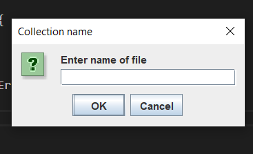
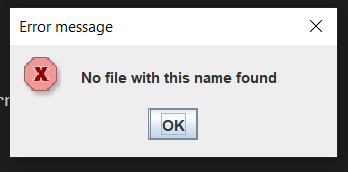
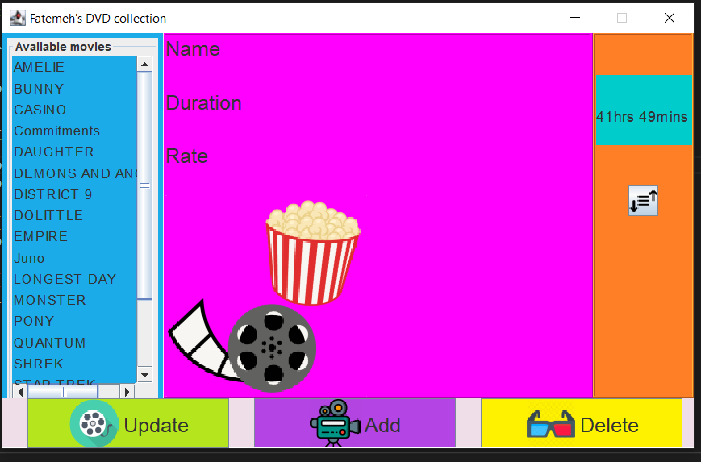

## A SWING and AWT deskatop application
This is a homework project from Software Engineering course.

A GUI that keep track of a collection of movies, where the movie data is read in through a file.

#### File format
'name of movie','rating of movie','duration of movie'

The GUI allows the user to enteract with their data, to make updates filter the view by movie ratings.

#### How to run:
Run the DVDManager.java file

Initial page:

If the file is not found

If file is found, data is loaded and GUI launches

